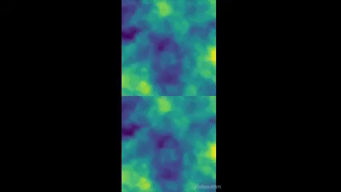

**Status:** Maintenance (expect bug fixes and minor updates)

 [](https://travis-ci.org/openai/baselines)

# Baselines-selfplay
This repository is primarily made to make it so that OpenAI's baselines(which can be found [here](https://github.com/openai/baselines)) can do self-play! By this, I made it so that it can now train by fighting against itself! One thing that I did here is that I decided that the agents look at an environment, do their actions(or do nothing), and only after all of them choose their actions, the environment updates. This was because for my environment I wanted this to be the case. However, if there is demand(from me or the users) I think I might add an option where if the user inputs, the environment updates! Also, I just finished making this so if you have any questions, please email me at <isamu.website@gmail.com>
# Execution
run
```
python -m baselines.run --env=your_env_id --env_type=your_env_type --self_play
```
Below I'll talk about the specifics of your_env_id, your_env_type, and also something called your_module_name
# Installation requirements
This repository, so far, is only tested with python 3.7.1 but it might work with other versions! Anyway, once you get that execute
```
git clone https://github.com/isamu-isozaki/baseline-selfplay.git
cd baseline-selfplay
pip install -e .
```
And it should be up and running!
# Environment requirements
I made this so that, I need to make sure, but it won't affect any of the usual OpenAI gyms. So, you can still do things with them. 
These requirements will include the requirements to make a custom environment 
However, requirements for the self-play environment is to
1. It must be a class
2. It has a sides attribute denoting the number of sides
3. There must be methods step, reset and render
4. The observation space and action space must be defined as attributes in the __init__ function of the environment like
```
from gym import spaces
self.observation_space = spaces.Box(low=0.0, high=1.0, shape=[10,10,3], dtype=np.float32)
self.action_space = spaces.Box(low=0.0, high=1.0, shape=[10], dtype=np.float32)
```
To see the list of spaces see [here](https://github.com/openai/gym/tree/master/gym/spaces)!
## Step function requirements
1. The step function must accept an action which must be 1 dimensional.
2. The step function returns None, None, None, None and saves the action of the side if some sides still haven't updated. This is because I wanted to update the environment only when all sides decided to make their move. Once all sides had set their action the function must return observations, rewards, whether the environment is done, a bool True or False value, and optional infos, a dictionary. 
3. All of the values returned must be returned in lists or numpy arrays where the base index denotes which side the given observation, reward, done, and optional info corresponds to. For example, obs[0] denotes the observation side 0 made after making the action and the environment updated.
4. The step function must set the action to the current side. The current side is computed by adding one to the current side(which starts from 0) and getting the remainder with self.sides!
## Reset function requirements
1. Reset environments and returns the observation in the same form as above but put it in a list. So, if we call the returned value obs, obs[0] corresponds the obs returned from the step function
## Render function requirements
1. Returns a rendered image in a list. So, img[0] will be the image. Returns a rendered images in a list. So, img[0] will be the images. And img[0][0] will be the rendered image for side 0. I used opencv for this function in my environment and it ended up looking like this!

It looks a bit bad for now and looks like the policy is a bit biased from the start(go to the top right corner) which I'll adjust later but for now. Anyway, it looks quite nice! The way the sight for both sides is concatenated into one side is done by OpenAI!
## Env_type requirements
This the folder in which the environment is going to be installed will be held. The folder structure of environment modules is like(thanks [Ashish Poddar](https://medium.com/@apoddar573/making-your-own-custom-environment-in-gym-c3b65ff8cdaa)!)
```
your_module_name/
  README.md
  setup.py
  your_module_name/
    __init__.py
    your_env_type/
      __init__.py
      env.py
```
This will be where your_env_type comes from. your_env_id will come from
```
from gym.envs.registration import register

register(
    id=your_env_id,
    entry_point=your_module_name.your_env_name:the_name_of_the_class_that_is_your_environment,
)
```
the name of the class that is your environment must be the class name of your environment.

Here, your_env_id needs to be in the for env_name-v0 or for those of you who like regex, 
```
^(?:[\w:-]+\/)?([\w:.-]+)-v(\d+)$
```
otherwise there will be an error.

Of course, all the above needs to be strings. This will go in the outer __init__ file. In the inner __init__ file you pretty much just import your environment but it must be referencing the module. By this, I mean that the inner __init__ file must import the environment via
```
import your_module_name.your_env_name.env import the_name_of_the_class_that_is_your_environment
```
Then, in your setup.py, just write something like
```
from setuptools import setup

setup(name=your_module_name,
      version='0.0.1',
      install_requires=[installation requirements]
)
```
The installation requirements should be in a list like
```
install_requires=["tensorflow-model-optimization==0.1.1",
"tqdm==4.39.0",
"wincertstore==0.2"]
```
And finally, just do
```
pip install -e . 
```
At the top level of your directory and you have both your self-play environment.
Then, go inside the baselines folder inside the cloned git repository. Inside it, you should find run.py. Replace the
```
import tactic_game_gym
```
with 
```
import your_module_name
```
I think I'll be able to make your_module_name an argument and import it but I tried and failed when using importlib so I'm currently thinking of another way. Anyway, until the day, please stick with this!
Then, run
```
pip install -e .
```
on the base directory of this cloned repository!
Finally, run
```
python -m baselines.run --env=your_env_id --env_type=your_env_type --self_play
```
and it should start training!
## A note on arguments
You can make more if you want but the basic arguments for the command above are
1. env - your environment ID the default id is Reacher-v2. The type is string.
2. env_type - type of environment, used when the environment type cannot be automatically determined. I set the default here to tactic_game but you can change it if you want! The type is string.
3. seed - This is your RNG seed. The default value is None and the type is int.
4. alg - This is which algorithm is going to be picked. The default is ppo2. The type is string
5. num_timesteps - The number of timesteps. The type is interestingly float and the default value is 1e6, which is a million. This is the number of timesteps the agent trains for.
6. network - This is the network type (mlp, cnn, lstm, cnn_lstm, conv_only) and the default is None. For ppo2, if this is set to None, mlp is selected(multilayer perceptron). I'm not sure about the other algorithms
7. gamestate - game state to load (so far only used in retro games). So, unless you are working with them, you can ignore this
8. num_env - Number of environment copies being run in parallel. When not specified, set to number of cpus for Atari, and to 1 for Mujoco. The default is None and the type is int!
9. reward_scale - Reward scale factor. This multiplies the reward by this factor on every timestep. The default is 1.0. And the type is float.
10. save_path - This is the path to save trained model to. The default is None. The type is string.
11. save_video_interval - Save video every x steps (0 = disabled). The default is 0. This will save the videos in a videos folder inside your log_path. The type is int
12. save_video_length - Length of recorded video. Default: 200. This will cut the video at this many timesteps and then go on to make a new one. The type is int
13. log_path - Directory to save learning curve data. The default is None and the type is string.
14. play - This will make the agent actually start playing after training until you stop it. I think I'll modify it so that if it is a multiplayer game. The default is false.
15. no_self_play - I added this parameter. If you want the environment to not be self-play just do --no_self_play. The default is False.

To cite this repository in publications:


    @misc{baselines\_selfplay,
      author = {Isamu Isozaki},
      title = {OpenAI Baselines selfplay},
      year = {2019},
      publisher = {GitHub},
      journal = {GitHub repository},
      howpublished = {\url{https://github.com/isamu-isozaki/baseline-selfplay.git}},
    }


    @misc{baselines,
      author = {Dhariwal, Prafulla and Hesse, Christopher and Klimov, Oleg and Nichol, Alex and Plappert, Matthias and Radford, Alec and Schulman, John and Sidor, Szymon and Wu, Yuhuai and Zhokhov, Peter},
      title = {OpenAI Baselines},
      year = {2017},
      publisher = {GitHub},
      journal = {GitHub repository},
      howpublished = {\url{https://github.com/openai/baselines}},
    }

